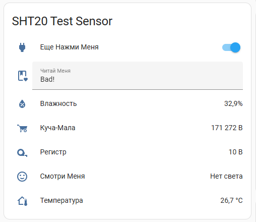

## SHT20 Sensor at Lua NodeMCU And Home Assistant MQTT Diccovery

Железка, хотя и работает самостоятельно, но является частью проекта [маньячных часов](https://github.com/igorkkk/__max7219_esp32_monitorGH), чей смысл максимально видеть качество воздуха и погоду. 

В железке реализован модуль MQTT Discovery для Home Assistant.

Отдельная благодарность [Birte Friesel](https://github.com/derf?tab=repositories&q=&type=&language=lua&sort=) за работу с Lua, кое-что заимствовано оттуда.  